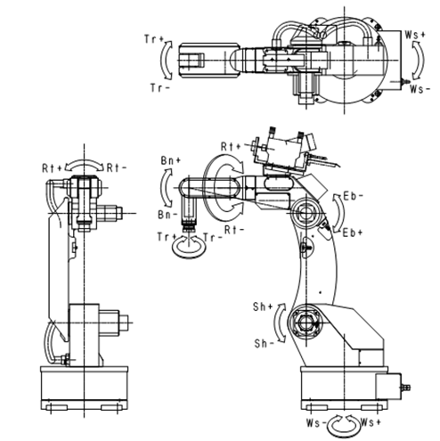

# この中はTEST文書です。
近藤さん、工藤さんに聞く
# タイトルは？です。

## 初めに

$f(x) = \sqrt{\frac{1}{x^2 + 1}}$

## Robot Manipulator とは
改変したのはだれでしょう？

## 挿絵例
１．まず

があります。

その他、行列は

${^6}B_8^{-1}
=\begin{pmatrix}
C_8&0&S_8&-a_7 C_8-d_7 S_8 \\
0&1&0&0\\
-S_8&0&C_8&a_7 S_8-d_7 C_8 \\
0&0&0&1
\end{pmatrix}
$

次に

$f(\relax{x}) = \int_{-\infty}^\infty
    f\hat(\xi)\,e^{2 \pi i \xi x}
    \,d\xi$

のとき以下の式が成立する。

$G(\theta)=\begin{pmatrix} 
\sin(\theta)&\cos(\theta) \\
-\cos(\theta)&\sin(\theta) \\
\end{pmatrix}$

これはGITHUBでは表示できず。残念!

以上